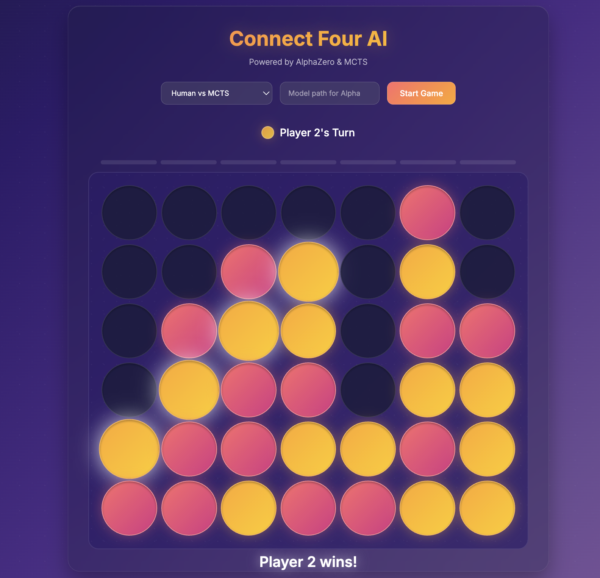

# Connect Four AI

An AlphaZero implementation for playing Connect Four with a web interface.




## Installation

1. Clone the repository:
```bash
git clone https://github.com/PaulTbbr/connect_4.git
cd connect_4
```

2. Install dependencies:
```bash
pip install -r requirements.txt
```

## Training

To train AlphaZero on connect 4:

```bash
python -m src.main train --game connect_four --n_blocks 9 --n_filters 128 --lr 0.001 --weight_decay 0.0001 --c 2 --n_searches 600 --n_iterations 8 --n_self_play_iterations 500 --n_epochs 4 --batch_size 128 --temperature 1.25 --dirichlet_epsilon 0.25 --dirichlet_alpha 0.3 --checkpoints_dir checkpoints/ 
```

For faster training with parallel self-play, add the flag `--parallel`. 

**Key Parameters**:
- `--n_parallel_games`: Number of concurrent self-play games (typically 50-200)
- `--n_self_play_iterations`: Total games per iteration (should be multiple of n_parallel_games)
- `--batch_size`: Mini-batch size for NN training
- `--c`: Exploration constant (higher = more exploration)
- `--temperature`: Controls policy randomness (1.0 = proportional to visit count)

## Playing

Run the web application with:
```bash
python -m webapp.app
```

The game is hosted at `http://localhost:5000`.

### Game Modes

- **Human vs Human**: Two-player mode
- **Human vs MCTS**: Play against Monte Carlo Tree Search
- **Human vs Alpha-MCTS**: Play against an AlphaZero-trained model


## Credits

Based on the AlphaZero implementation from:
- Tutorial: https://www.youtube.com/watch?v=wuSQpLinRB4&list=WL&index=20
- Repository: https://github.com/foersterrobert/AlphaZeroFromScratch

